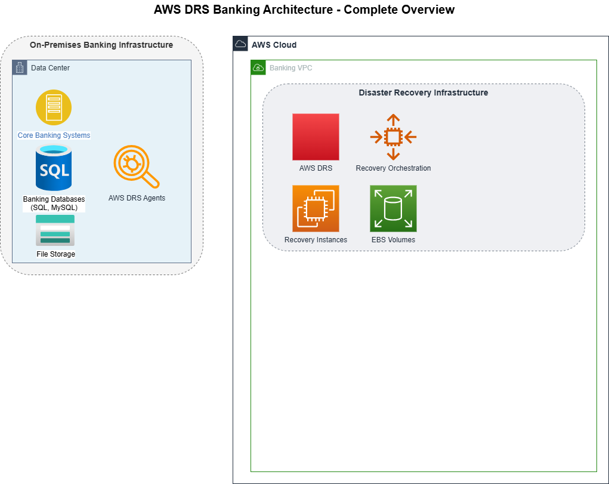

# AWS Disaster Recovery Solution (DRS) for Banking Environments

## Overview

This enterprise-grade disaster recovery (DR) solution is specifically designed for banking and financial institutions requiring high security, compliance with regulatory standards, and minimal data loss. The solution uses **Ireland (eu-west-1)** as the AWS target region for disaster recovery of on-premise infrastructure.

## Key Features

### Security & Compliance

- **Comprehensive Encryption**: KMS-based encryption for all data at rest and in transit
- **Regulatory Compliance**: Mapped controls for GDPR, GLBA, PCI DSS, and FFIEC requirements
- **Data Classification**: Automated classification and protection for sensitive banking data
- **Access Controls**: Least privilege IAM policies and role-based access controls
- **Secrets Management**: Secure credential management with AWS Secrets Manager

### Recovery Capabilities

- **Sub-second RPO**: Block-level replication with minimal data loss
- **Minutes RTO**: Fast recovery for critical banking systems
- **Automated Recovery**: Orchestrated recovery processes via AWS Step Functions
- **Application Consistency**: Transaction-aware recovery for financial applications
- **Non-disruptive Testing**: Test DR without impacting production systems

### Multi-layered Protection

- **3-AZ High Availability Design**: Full resilience across three Availability Zones within AWS
- **Advanced DLP**: Data Loss Prevention for sensitive financial information
- **Automated Validation**: Pre and post-recovery integrity checks

## DR Solution Options


| Feature       | Option 1: AWS DRS with VPN         | Option 2: AWS DRS with Direct Connect + VPN (Hybrid) |
| ------------- | ---------------------------------- | ---------------------------------------------------- |
| Connectivity  | Site-to-Site VPN                   | Direct Connect + Client VPN                          |
| Performance   | Good                               | Excellent                                            |
| Reliability   | Standard                           | High (99.99% SLA)                                    |
| Cost          | Lower                              | Higher                                               |
| Complexity    | Simple                             | Moderate                                             |
| Compliance    | Standard                           | Enhanced                                             |
| Documentation | [DRS-proposal.md](DRS-proposal.md) | [HYBRID-PROPOSAL.md](HYBRID-PROPOSAL.md)             |

### Option 1: AWS DRS with VPN


A secure, cost-effective solution using AWS Elastic Disaster Recovery Service (DRS) with VPN connectivity for replication and access:

- Site-to-Site VPN for encrypted connectivity between on-premises and AWS
- Client VPN for secure remote user access during DR events
- Block-level replication with sub-second RPO
- Minutes RTO for critical banking systems
- Comprehensive encryption for data at rest and in transit
- Automated recovery orchestration for critical applications
- Detailed recovery runbooks for banking applications
- Continuous compliance monitoring and reporting

Best for: Financial institutions prioritizing cost-effectiveness while maintaining high security and compliance standards.

### Option 2: AWS DRS with Direct Connect + VPN (Hybrid)



An enhanced DR solution combining the benefits of Direct Connect and VPN, specifically designed for banks with the highest compliance requirements:

- AWS Direct Connect for dedicated, high-performance, private replication
- Client VPN for secure, flexible user access during DR events
- SLA-backed connectivity (99.99% availability)
- Enhanced security with private network connectivity
- Superior regulatory compliance for financial institutions
- Advanced data loss prevention for sensitive banking information
- Automated compliance reporting and real-time monitoring

Best for: Banking organizations requiring the highest reliability, performance, and regulatory compliance.

### Cost and Benefit Analysis

Review our [cost comparison document](docs/cost-comparison.md) to understand the financial implications of each option and the return on security investment.

## Project Structure

```
AWS_DRS_POC/
├── README.md                 # Project overview and key features
├── DRS-proposal.md           # Option 1: VPN-only solution details
├── HYBRID-PROPOSAL.md        # Option 2: Hybrid with Direct Connect details
├── ARCHITECTURE.md           # Architecture and infrastructure details
├── SECURITY_FEATURES.md      # Security features details
├── docs/                     # Additional documentation
│   ├── cost-comparison.md             # Cost comparison between options
│   ├── data_classification_framework.md # Data classification and tagging strategy
│   ├── detailed_recovery_runbooks.md   # Application-specific recovery procedures
│   ├── hybrid_connectivity.md         # Hybrid connectivity details
│   ├── recovery_strategy.md           # Backup and recovery strategy
│   ├── regions.md                     # Details about the AWS target region
│   ├── regulatory_compliance_framework.md # Regulatory mapping (GDPR, FFIEC, etc.)
│   ├── replication_strategy.md        # Replication strategy documentation
│   └── terraform-implementation.md    # Technical implementation details
└── modules/                  # Terraform modules
    ├── compute/              # Compute resources configuration
    ├── database/             # Database resources configuration 
    ├── data_protection/      # Data Loss Prevention (DLP) implementation
    ├── direct_connect/       # Direct Connect configuration
    ├── drs/                  # AWS Elastic DR Service module
    ├── iam/                  # Identity and Access Management 
    ├── kms/                  # Key Management Service for encryption
    ├── logging/              # Comprehensive logging configuration
    ├── monitoring/           # Enhanced monitoring and alerting
    ├── networking/           # VPC, subnets, VPN configuration
    ├── recovery_orchestration/ # Automated recovery workflows
    ├── secrets_manager/      # Secure secrets management
    ├── security/             # Security configuration
    ├── security_compliance/  # Compliance monitoring and reporting
    └── storage/              # Storage resources configuration
```

## Getting Started

1. **Understand the Solution**:

   - Review both DR options in their respective documentation: [DRS-proposal.md](DRS-proposal.md) and [HYBRID-PROPOSAL.md](HYBRID-PROPOSAL.md)
   - Review the [regulatory compliance framework](docs/regulatory_compliance_framework.md) to understand how this solution meets banking requirements
   - Study the [data classification framework](docs/data_classification_framework.md) to understand protection mechanisms
2. **Compare Options**:

   - Analyze the cost implications using the [cost comparison document](docs/cost-comparison.md)
   - Review the [recovery strategy](docs/replication_strategy.md) for risk mitigation
   - Understand the [recovery runbooks](docs/detailed_recovery_runbooks.md) for banking applications
3. **Implementation**:

   - Select the most appropriate option based on your security and compliance requirements
   - Review the [technical implementation details](docs/terraform-implementation.md) for Terraform code
   - Understand the [region configuration](docs/regions.md) for the AWS target region (Ireland)
   - Follow the implementation instructions in the [architecture and infrastructure document](ARCHITECTURE.md)
4. **Testing and Validation**:

   - Perform recovery testing following the runbooks
   - Validate compliance using the automated compliance checks
   - Test the automated recovery orchestration workflows
   - Verify data protection mechanisms are functioning as expected

This project is configured to use:

- **Target region**: Ireland (eu-west-1)

This region was selected for its compliance with European data regulations and complete service availability.

## Security and Compliance Features

### Advanced Security Controls

- **Comprehensive Encryption**: All data encrypted at rest and in transit using KMS
- **Secure Access Management**: Least privilege IAM policies and multi-factor authentication
- **Network Security**: Security groups, NACLs, VPC endpoints, and private connectivity
- **Monitoring and Alerting**: Real-time security monitoring with CloudWatch and Security Hub

### Banking Regulatory Compliance

- **GDPR Compliance**: Data protection controls and documentation
- **FFIEC Requirements**: Meets financial institution examination requirements
- **PCI DSS**: Protection for cardholder data in the DR environment
- **GLBA**: Controls for safeguarding customer financial information

### Data Protection

- **Data Classification**: Automatic identification and tagging of sensitive data
- **Data Loss Prevention**: Macie-based DLP with custom identifiers for financial data
- **Data Sovereignty**: Controls to maintain data within specified jurisdictions
- **Data Validation**: Automated checks for data integrity before and after recovery

## Security and Compliance Design

### Banking-Specific Security Features

- **3-AZ Architecture**: Maximum resilience with resources distributed across three availability zones
- **Automated Recovery Orchestration**: AWS Step Functions for controlled recovery processes
- **Advanced Data Protection**: AWS Macie and custom DLP for sensitive financial data
- **Enhanced Compliance Mapping**: Detailed mapping to banking regulations
- **Detailed Recovery Runbooks**: Application-specific recovery procedures for banking systems

See [SECURITY_FEATURES.md](SECURITY_FEATURES.md) for detailed information about these security features.
